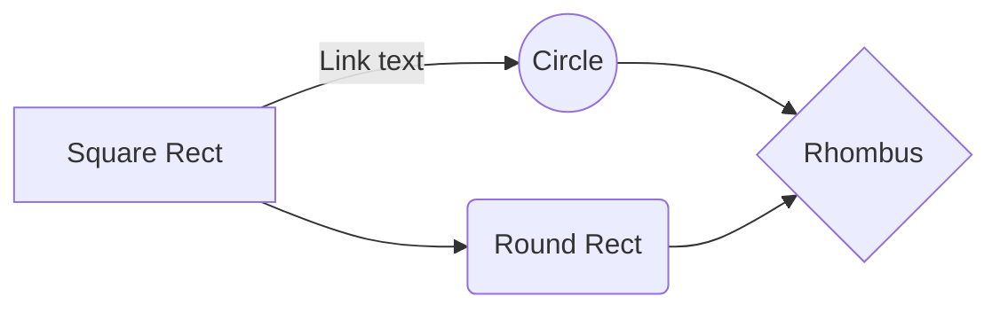

# typostry

A Next.js markdown editor with real-time preview, grammar checking, theme support, and diagram rendering.

## Description

`typostry` is a feature-rich markdown editor built with Next.js that provides a seamless writing experience with real-time preview and advanced features like grammar checking, emoji support, executable JavaScript code blocks, Mermaid diagrams, and template selection from GitLab repositories.

## Features

### Markdown Editor
- Real-time markdown preview
- Toolbar with common markdown formatting shortcuts
- Theme support (light/dark)
- Emoji support using `:emoji_code:` syntax
- Executable JavaScript code blocks in preview mode
- Mermaid diagram support for visualizations
- Keyboard shortcuts for common operations
- Template selection from GitLab repositories

### Templates from GitLab
- Integration with GitLab repositories to fetch markdown templates
- Configurable repository URL and authentication token
- Preview and insert templates directly into your document
- Caching to reduce API calls
- API route at `/api/gitlab/templates` that connects to GitLab

### Grammar Checking
- Real-time grammar and spelling error detection
- Suggestions for corrections
- Custom dictionary support
- Different severity levels for errors (low, medium, high)
- Error categorization (spelling, grammar, style, punctuation)

### File System Operations
- Create new files
- Open existing files directly from the local filesystem
- Save files directly to the opened file
- Save As functionality

## Limitations

- Grammar checking uses the LanguageTool API with the following limitations:
  - 20 requests per minute
  - 75KB per minute
  - 20KB per request
  - Maximum text length of 10,000 characters per check
  - Minimum 5 seconds between requests
- File System Access API is only supported in Chrome 86+, Edge 86+, and Opera 72+
  - Falls back to traditional file input and download methods in other browsers

## Tech Stack

- **Frontend Framework**: Next.js 14+ with app router
- **Language**: TypeScript
- **Styling**: Tailwind CSS
- **UI Components**: shadcn/ui (built on Radix UI)
- **Markdown Processing**: remark, micromark
- **Code Highlighting**: Prism
- **Type Safety**: Zod for schema validation

## External Dependencies

- **LanguageTool API**: Used for grammar and spell checking
  - Primary endpoint: https://api.languagetool.org/v2/check
  - Fallback endpoint: https://languagetool.org/api/v2/check
- **GitLab API**: Used for fetching templates
  - Requires a GitLab repository URL and access token
- **File System Access API**: Modern browser API for file system operations

## Usage

1. Install dependencies:
```bash
npm install
# or
yarn install
```

2. Copy `.env.example` to `.env.local`:
```bash
cp .env.example .env.local
```

3. Configure environment variables in `.env.local`:
```
# Required for basic functionality
NEXT_PUBLIC_APP_URL=http://localhost:3000

# Unsplash API credentials (optional but recommended for image features)
# Server-side keys (not exposed in client bundles)
UNSPLASH_ACCESS_KEY=your_unsplash_access_key
UNSPLASH_SECRET_KEY=your_unsplash_secret_key
# Client-side key (will be exposed in browser)
NEXT_PUBLIC_UNSPLASH_ACCESS_KEY=your_unsplash_access_key

# Optional: GitLab API configuration for templates
NEXT_PUBLIC_GITLAB_REPO_URL=https://gitlab.com/your-repo-path
NEXT_PUBLIC_GITLAB_TOKEN=your_gitlab_access_token
```

Note: Environment variables prefixed with `NEXT_PUBLIC_` will be included in the client-side JavaScript bundle. Only use this prefix for non-sensitive values or public API keys that are restricted by domain.

4. Run the development server:
```bash
npm run dev
# or
yarn dev
# or
npx next dev
```

5. Open [http://localhost:3000](http://localhost:3000) in your browser to see the application.

## Component Usage

```jsx
import { MarkdownEditor } from "@/components/markdown-editor";

export default function YourComponent() {
  return (
    <MarkdownEditor 
      initialValue="# Hello World\n\nI'm happy :smile: about this editor!"
      onChange={(value) => console.log(value)}
    />
  );
}
```

## Mermaid Diagram Support

The editor supports Mermaid diagrams for creating visualizations directly in your markdown. Simply use a code block with the "mermaid" language identifier:

```markdown


This will render as an interactive diagram in the preview:


