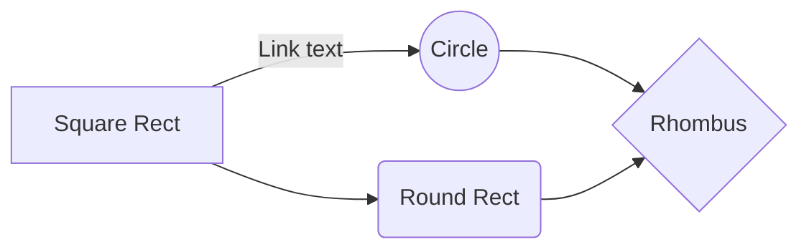

# typostry

A Next.js markdown editor with real-time preview, grammar checking, theme support, and diagram rendering.

## Description

`typostry` is a feature-rich markdown editor built with Next.js that provides a seamless writing experience with real-time preview and advanced features like grammar checking, emoji support, executable JavaScript code blocks, Mermaid diagrams, and template selection from GitLab repositories.

## Features

### Markdown Editor
- Real-time markdown preview
- Toolbar with common markdown formatting shortcuts
- Theme support (light/dark)
- Emoji support using `:emoji_code:` syntax
- Executable JavaScript code blocks in preview mode
- Mermaid diagram support for visualizations
- Keyboard shortcuts for common operations
- Template selection from GitLab repositories
- **AI-powered text tools**: Summarize selected text using Hugging Face models

### Templates from GitLab
- Integration with GitLab repositories to fetch markdown templates
- Configurable repository URL and authentication token
- Preview and insert templates directly into your document
- Caching to reduce API calls
- API route at `/api/gitlab/templates` that connects to GitLab

### Grammar Checking
- Real-time grammar and spelling error detection
- Suggestions for corrections
- Custom dictionary support
- Different severity levels for errors (low, medium, high)
- Error categorization (spelling, grammar, style, punctuation)

### File System Operations
- Create new files
- Open existing files directly from the local filesystem
- Save files directly to the opened file
- Save As functionality
- **Auto-save to localStorage**: Automatically saves your work to browser localStorage every 2 seconds
- **Recovery on load**: If unsaved content is detected when you return, you'll see a recovery banner with the option to restore your work
- Recovery shows how long ago the content was saved

## Limitations

- Grammar checking uses the LanguageTool API with the following limitations:
  - 20 requests per minute
  - 75KB per minute
  - 20KB per request
  - Maximum text length of 10,000 characters per check
  - Minimum 5 seconds between requests
- File System Access API is only supported in Chrome 86+, Edge 86+, and Opera 72+
  - Falls back to traditional file input and download methods in other browsers

## Tech Stack

- **Frontend Framework**: Next.js 14+ with app router
- **Language**: TypeScript
- **Styling**: Tailwind CSS
- **UI Components**: shadcn/ui (built on Radix UI)
- **Markdown Processing**: remark, micromark
- **Code Highlighting**: Prism
- **Type Safety**: Zod for schema validation
- **Monospace Font**: [Xenia](https://github.com/Loretta1982/xenia) for code blocks and math formulas

## External Dependencies

- **LanguageTool API**: Used for grammar and spell checking
  - Primary endpoint: https://api.languagetool.org/v2/check
  - Fallback endpoint: https://languagetool.org/api/v2/check
- **GitLab API**: Used for fetching templates
  - Requires a GitLab repository URL and access token
- **Hugging Face Inference API**: Used for AI-powered text summarization
  - Model: facebook/bart-large-cnn
  - Requires a free Hugging Face API token
- **File System Access API**: Modern browser API for file system operations

## Usage

1. Install dependencies:
```bash
npm install
# or
yarn install
```

2. Set up the Xenia monospace font (required for code and math):
```bash
npm run setup:fonts
```
This will automatically download and install the Xenia font family. For manual installation, see [FONT_SETUP.md](./FONT_SETUP.md).

3. Copy `.env.example` to `.env.local`:
```bash
cp .env.example .env.local
```

4. Configure environment variables in `.env.local`:
```
# Required for basic functionality
NEXT_PUBLIC_APP_URL=http://localhost:3000

# Optional: Unsplash API credentials for image features
UNSPLASH_ACCESS_KEY=your_unsplash_access_key
UNSPLASH_SECRET_KEY=your_unsplash_secret_key

# Optional: GitLab templates repository
NEXT_PUBLIC_GITLAB_REPO_URL=https://gitlab.com/your-repo-path

# Optional: Server-side AI credentials
HF_API_KEY=your_huggingface_api_key
GRAZIE_TOKEN=your_grazie_jwt_token

# Optional: Extra trusted origins for API route protection
INTERNAL_API_ALLOWED_ORIGINS=https://your-app.example.com
```

Note: Environment variables prefixed with `NEXT_PUBLIC_` will be included in the client-side JavaScript bundle. Do not place provider secrets in those variables.

5. Run the development server:
```bash
npm run dev
# or
yarn dev
# or
npx next dev
```

6. Open [http://localhost:3000](http://localhost:3000) in your browser to see the application.

## Component Usage

```jsx
import { MarkdownEditor } from "@/components/markdown-editor";

export default function YourComponent() {
  return (
    <MarkdownEditor 
      initialValue="# Hello World\n\nI'm happy :smile: about this editor!"
      onChange={(value) => console.log(value)}
    />
  );
}
```

## Auto-Save & Recovery

The editor automatically saves your work to browser localStorage to prevent data loss:

### How it works
- **Automatic saving**: Content is automatically saved to localStorage every 2 seconds after you stop typing
- **Recovery on reload**: When you return to the editor, if unsaved content is detected, a recovery banner appears
- **Smart detection**: The recovery banner only appears if the saved content differs from the initial value
- **Timestamp display**: Shows how long ago the content was saved (e.g., "5 minutes ago", "2 hours ago")
- **User control**: You can choose to recover the content or dismiss it

### Recovery Banner
When recoverable content is found, you'll see an amber-colored banner at the top with two options:
- **Recover**: Restores the auto-saved content to the editor
- **Dismiss**: Clears the auto-saved content from localStorage and proceeds with the current state

### Data Persistence
- Auto-saved data is stored in your browser's localStorage
- Data persists across browser sessions
- Successfully saving a file to the file system clears the auto-save data
- Creating a new file clears the auto-save data

### Privacy
- All auto-save data is stored locally in your browser
- No data is sent to any server
- Clearing your browser data will remove auto-saved content

## Mermaid Diagram Support

The editor supports Mermaid diagrams for creating visualizations directly in your markdown. Simply use a code block with the "mermaid" language identifier:

````markdown

```mermaid
graph LR
A[Square Rect] -- Link text --> B((Circle))
A --> C(Round Rect)
B --> D{Rhombus}
C --> D
```
````

This will render as an interactive diagram in the preview:


