# Mermaid Diagrams

This document demonstrates various types of diagrams using Mermaid syntax.

## Flowchart

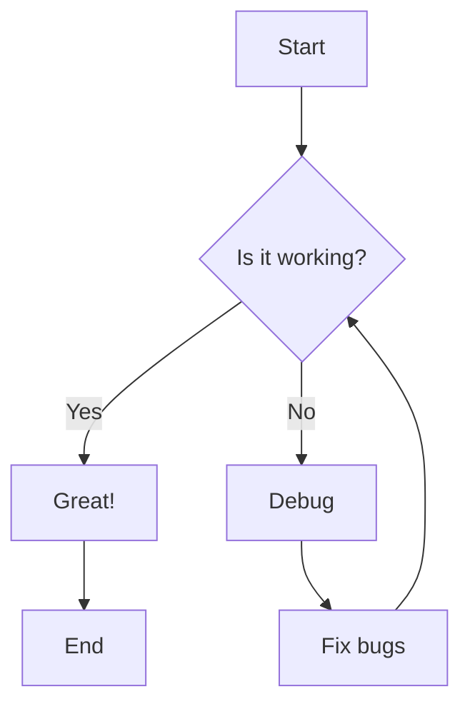

## Sequence Diagram

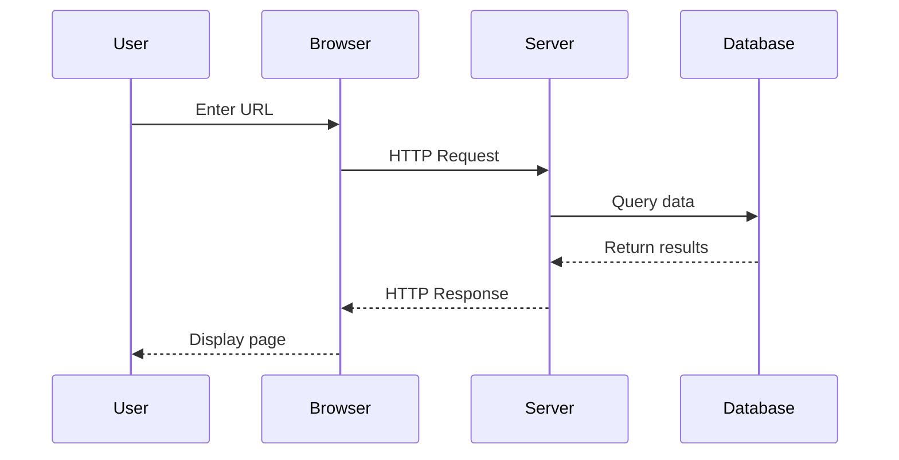

## Class Diagram

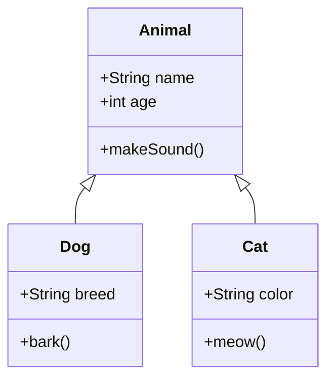

## State Diagram

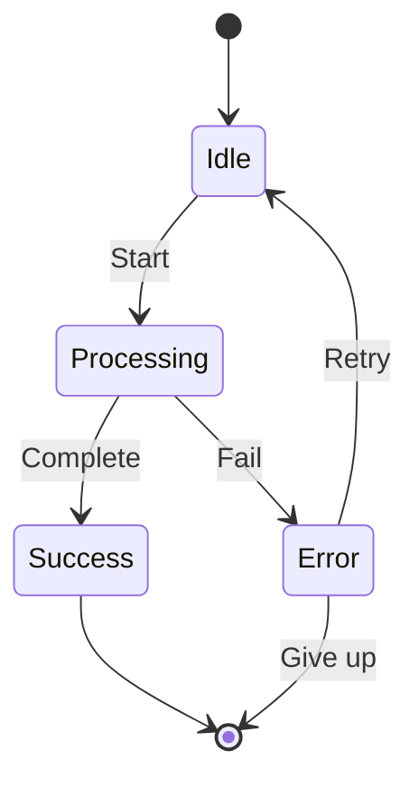

## Entity Relationship Diagram

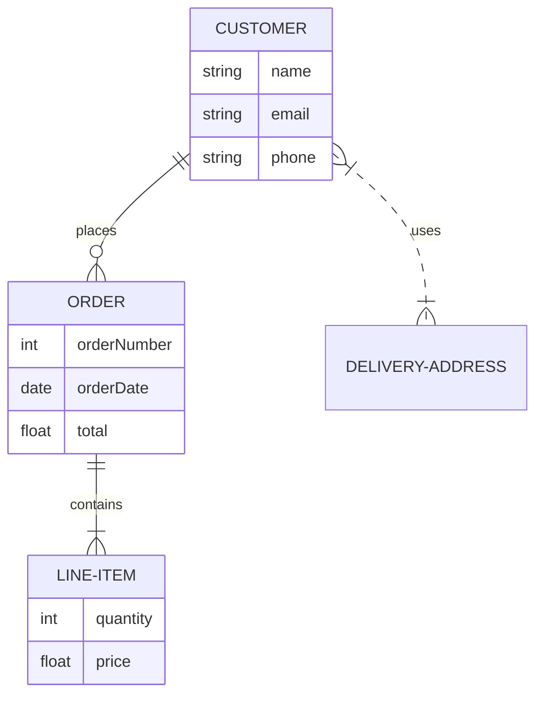

## Gantt Chart

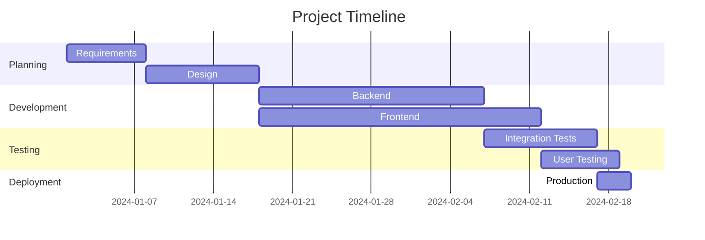

## Pie Chart

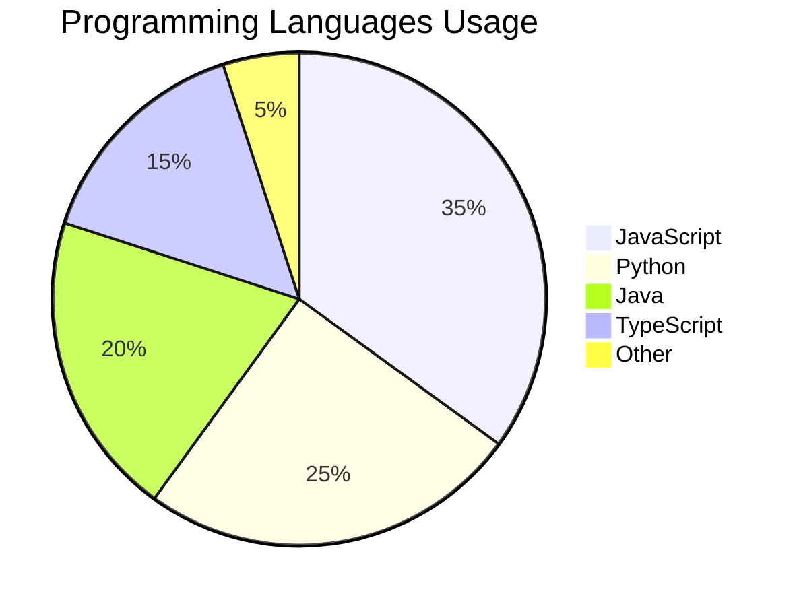

## Git Graph

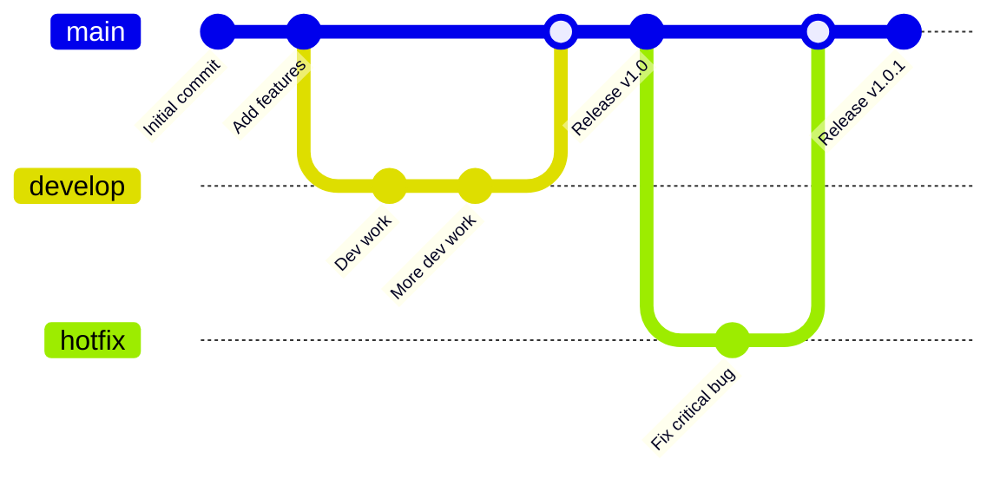

## User Journey

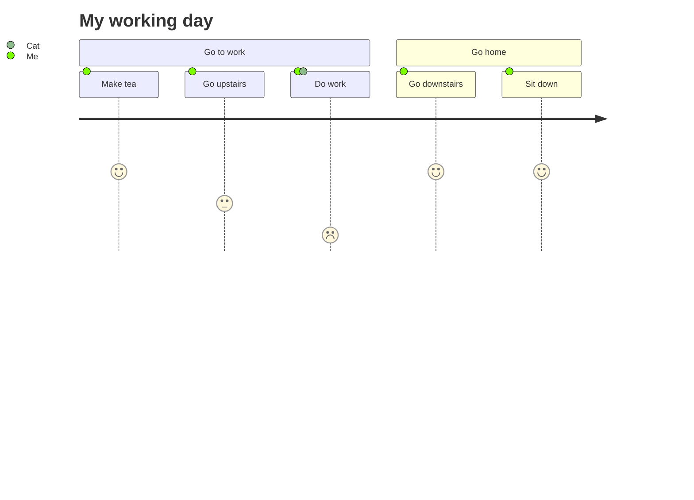

## Requirement Diagram

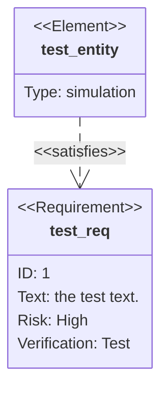

## Mind Map

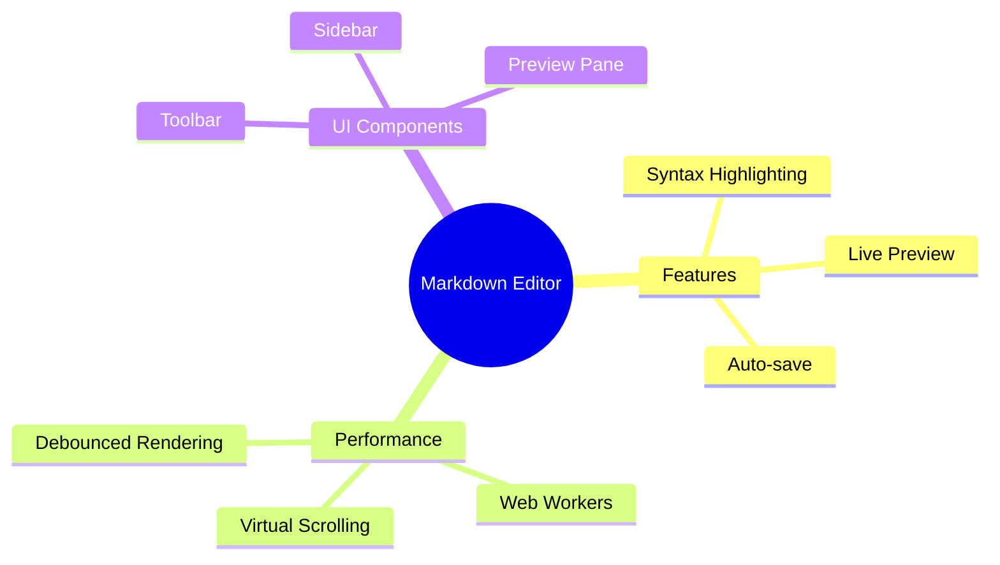

## Timeline

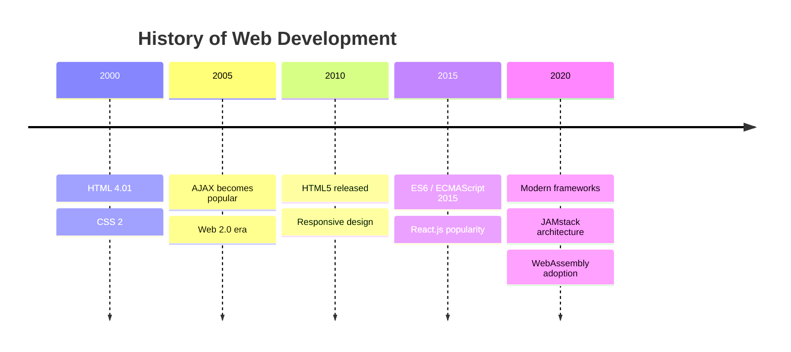

## Architecture Diagram (C4 Model Style)

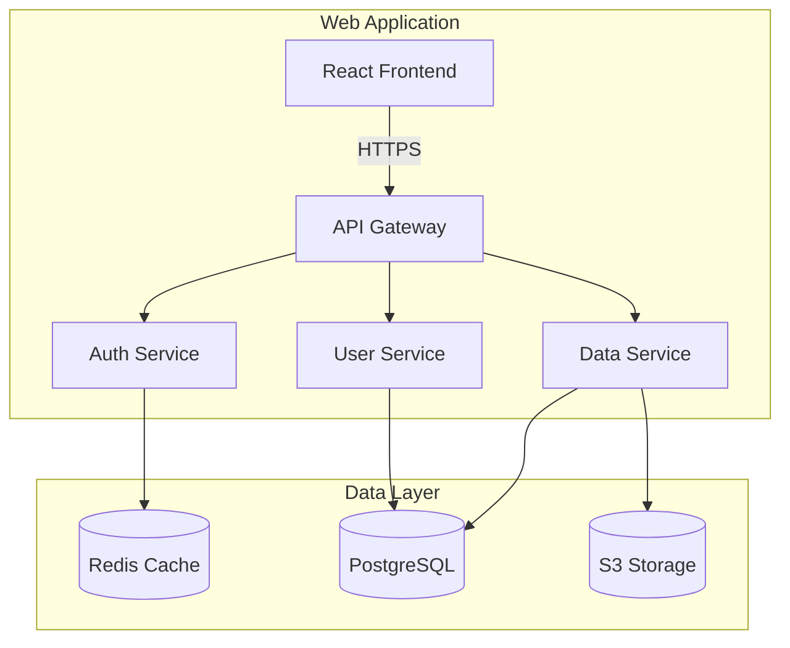

## Complex Flowchart

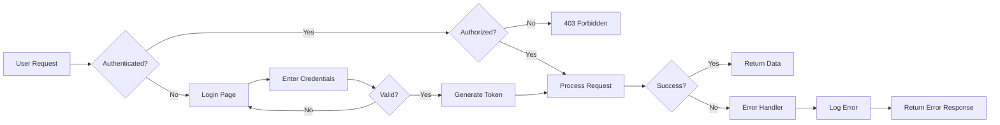

## Network Diagram

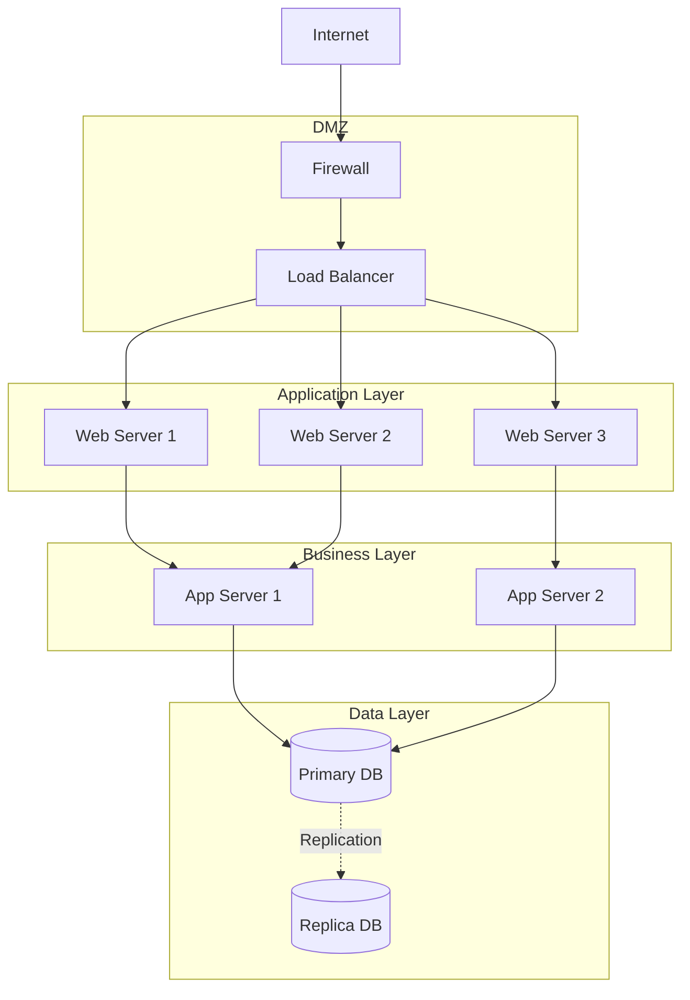

## Testing Flow

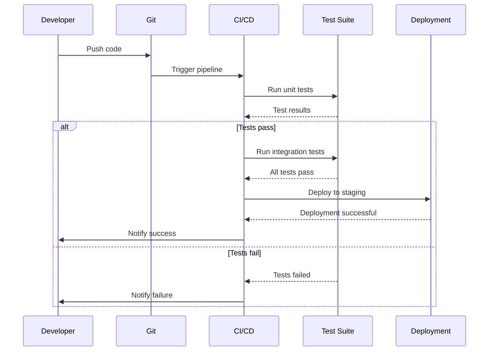

## End Notes

This document demonstrates the various types of Mermaid diagrams supported by the markdown editor. Each diagram type serves different visualization needs for documentation and technical communication.
