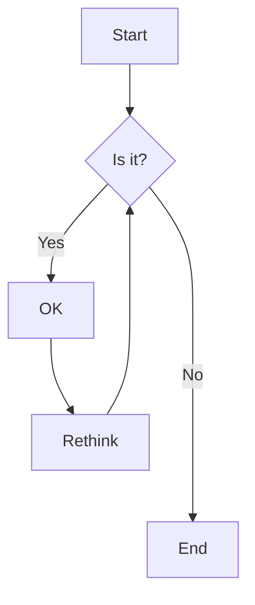
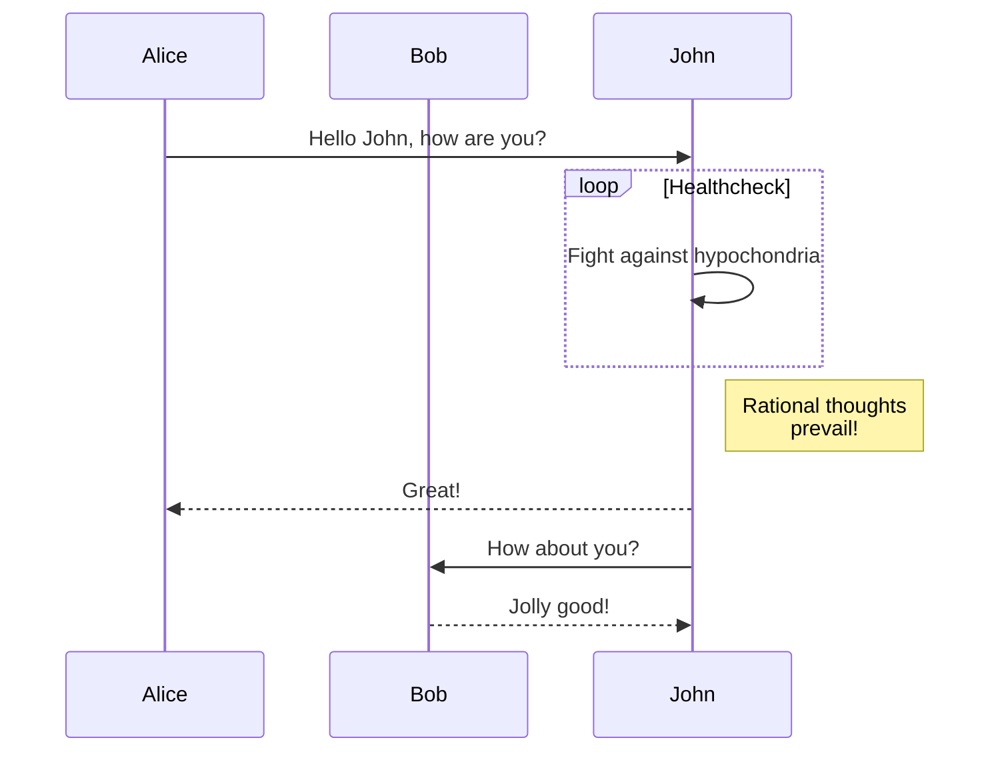
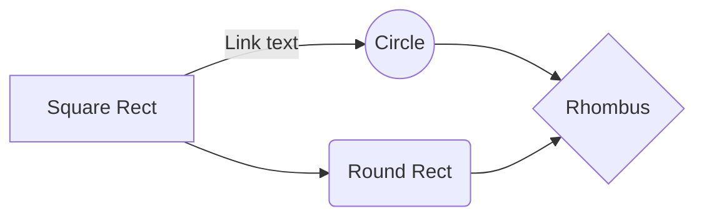
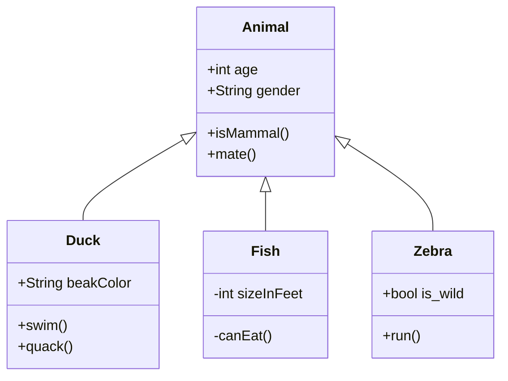
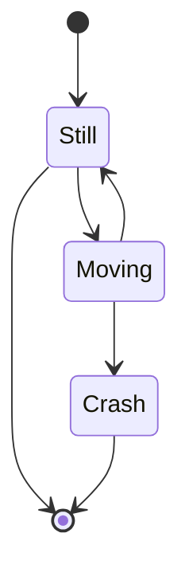

# Markdown Diagrams

This editor supports creating diagrams in your markdown using [Mermaid.js](https://mermaidjs.github.io/).

## How to Use

To create a diagram, use a code fence with the language set to "mermaid":

````

````

## Diagram Types

### Sequence Diagrams

Sequence diagrams show how processes interact with each other and in what order.

````

````

### Flowcharts

Flowcharts are diagrams that represent workflows or processes.

````

````

### Class Diagrams

Class diagrams show the structure of object-oriented systems.

````

````

### State Diagrams

State diagrams show how an entity responds to various events.

````

````

## Notes

- Diagrams are rendered client-side only to avoid SSR issues
- Diagram theme automatically matches your current editor theme (light/dark)
- For complex diagrams, consider writing them in a dedicated editor and pasting into the markdown when complete