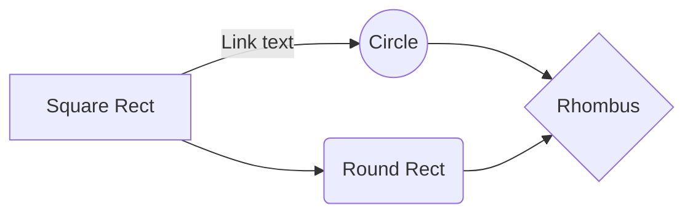
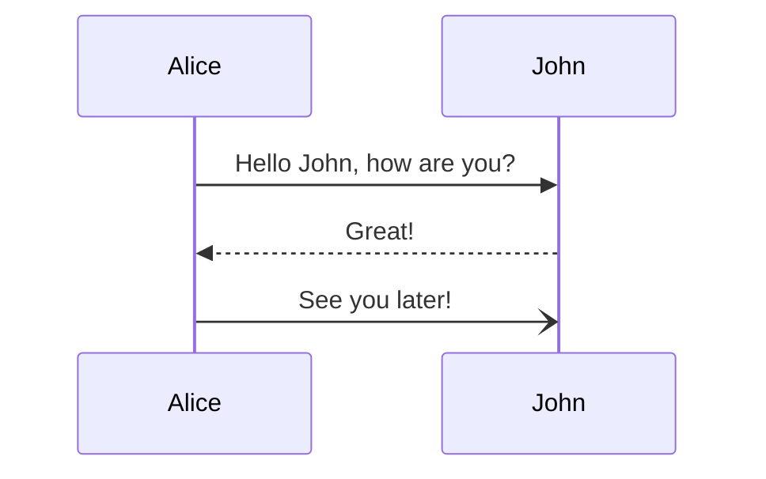

# Markdown Editor

A feature-rich Markdown editor with real-time preview, built with React and Next.js.

## Features

- Real-time preview with split-screen and full-screen modes
- Support for GitHub Flavored Markdown
- Toolbar with common formatting options
- Emoji support using `:emoji_code:` syntax
- Grammar and spelling checking with LanguageTool API
- Executable JavaScript code blocks
- Mermaid diagram support
- File system operations (open, save, save as)
- Keyboard shortcuts for common actions
- Dark and light theme support
- Reading statistics (words, chars, reading time)

## Usage

```jsx
import { MarkdownEditor } from "@/components/markdown-editor"

export default function MyEditor() {
  return (
    <MarkdownEditor
      initialValue="# Hello World"
      onChange={(value) => console.log(value)}
    />
  )
}
```

## Props

| Prop           | Type     | Default     | Description                              |
| -------------- | -------- | ----------- | ---------------------------------------- |
| `initialValue` | string   | `""`        | Initial markdown content                 |
| `onChange`     | function | `undefined` | Callback fired when content changes      |
| `className`    | string   | `undefined` | Additional class names for the container |

## Mermaid Diagram Support

The editor supports Mermaid.js diagrams for creating visualizations directly in your markdown. Use a code block with the "mermaid" language identifier:

````markdown

````

This will render as an interactive diagram in the preview mode.

### Supported Diagram Types

- Flowcharts
- Sequence diagrams
- Class diagrams
- State diagrams
- Entity Relationship diagrams
- User Journey diagrams
- Gantt charts
- Pie charts

### Example: Sequence Diagram

````markdown

````

## Keyboard Shortcuts

See [KEYBOARD_SHORTCUTS.md](./KEYBOARD_SHORTCUTS.md) for a full list of available keyboard shortcuts.
